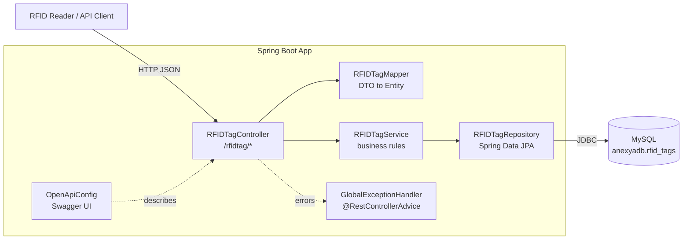
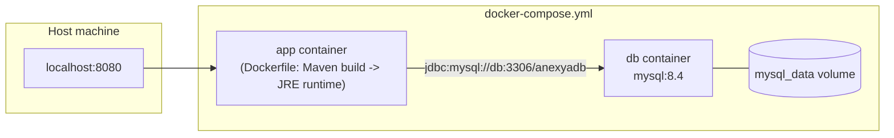

# Anexya RFID

A Spring Boot REST API for recording, retrieving, updating and deleting RFID tag reads (e.g. from warehouse or dock-door readers), backed by MySQL.

## Tech Stack

- **Java 21**, **Spring Boot 3.5**
- Spring Web (REST controllers), Spring Data JPA, Bean Validation
- MySQL 8.4 (via `mysql-connector-j`)
- springdoc-openapi (Swagger UI)
- Lombok
- Maven (wrapper included, no local Maven install required)
- Docker / Docker Compose for containerized runs

## Architecture



**Request flow:** a client (or RFID reader integration) calls `RFIDTagController`, which validates the incoming `RfidDto`, converts it to an `RFIDTag` entity via `RFIDTagMapper`, and delegates business logic (duplicate-EPC checks, existence checks) to `RFIDTagService`. The service uses `RFIDTagRepository` (Spring Data JPA) to persist to/read from MySQL. Validation and persistence errors are caught centrally by `GlobalExceptionHandler` and turned into consistent JSON error responses.

### Deployment (Docker Compose)



The `app` container is built via a multi-stage `Dockerfile` (Maven build stage producing the jar, then a slim `eclipse-temurin` JRE runtime stage). `docker-compose.yml` wires it to a `db` container running MySQL 8.4, with the app connecting over the Docker network via the `db` hostname, and MySQL data persisted in a named volume (`mysql_data`).

## Data Model

`RFIDTag` (table `rfid_tags`):

| Field      | Type            | Constraints                          |
|------------|-----------------|---------------------------------------|
| `TID`      | UUID (PK)       | Auto-generated                        |
| `siteName` | String          | Required                              |
| `epc`      | String          | Required, **unique**                  |
| `location` | String          | Required                              |
| `rssi`     | int             | Required, `>= 0`                      |
| `date`     | LocalDateTime   | Required, set server-side on create   |

## API Reference

Base path: `/rfidtag`

| Method | Path                | Description                                  | Success | Errors |
|--------|---------------------|-----------------------------------------------|---------|--------|
| GET    | `/rfidtag/get/{tid}`| Get a tag by TID                              | 200     | 404 |
| POST   | `/rfidtag/create`   | Create a new tag read (`RfidDto` body)        | 201     | 400 (validation), 409 (duplicate EPC) |
| PUT    | `/rfidtag/update/{tid}` | Update an existing tag by TID (`RfidDto` body) | 200 | 400, 404, 409 |
| DELETE | `/rfidtag/delete/{tid}` | Delete a tag by TID                       | 200     | 404, 500 |

`RfidDto` request body:

```json
{
  "siteName": "Warehouse A",
  "epc": "E28011606000021D3A2A1B2C",
  "location": "Dock Door 3",
  "rssi": 45
}
```

Validation and conflict errors are returned as a JSON array of strings, e.g. `["epc: EPC already exists"]`.

Interactive API docs (Swagger UI) are available once the app is running at:

- Swagger UI: `http://localhost:8080/swagger-ui.html`
- OpenAPI JSON: `http://localhost:8080/v3/api-docs`

## Setup

### Prerequisites

- Java 21 JDK
- MySQL 8.x (if running the app outside Docker)
- Docker + Docker Compose (if running containerized)

### 1. Configure environment variables

Create a `.env` file in the project root (this file is git-ignored) with:

```
DB_USERNAME=your_db_username
DB_PASSWORD=your_db_password
```

These are read both by Spring Boot directly (via `spring-dotenv`) and by Docker Compose.

### 2a. Run locally (Maven + local MySQL)

1. Ensure a MySQL instance is running on `localhost:3306` with a database named `anexyadb` (or update `spring.datasource.url` in [application.properties](src/main/resources/application.properties)), and that the credentials in `.env` are valid for it.
2. Start the app:

   ```powershell
   ./mvnw.cmd spring-boot:run
   ```

   (On macOS/Linux: `./mvnw spring-boot:run`)

3. The API is available at `http://localhost:8080`.

`spring.jpa.hibernate.ddl-auto=update` means the `rfid_tags` table is created/updated automatically on startup — no manual migration step is needed for local dev.

### 2b. Run with Docker Compose (app + MySQL)

```bash
docker compose up --build
```

This builds the app image, starts a MySQL 8.4 container, and starts the app connected to it. The API is available at `http://localhost:8080`. Data persists across restarts in the `mysql_data` Docker volume.

To stop:

```bash
docker compose down
```

To stop and wipe the database volume:

```bash
docker compose down -v
```

### Running tests

```powershell
./mvnw.cmd test
```

Tests cover the controller ([RFIDTagControllerTest](src/test/java/com/example/anexya_RFID/controller/RFIDTagControllerTest.java)) and service ([RFIDTagServiceTest](src/test/java/com/example/anexya_RFID/service/RFIDTagServiceTest.java)) layers.

## Operational Guide

### Health / smoke check

After starting the app, confirm it's up by hitting Swagger UI or listing a tag that doesn't exist yet:

```bash
curl http://localhost:8080/rfidtag/get/00000000-0000-0000-0000-000000000000
# expect: 404
```

### Common tasks

**Create a tag read:**

```bash
curl -X POST http://localhost:8080/rfidtag/create \
  -H "Content-Type: application/json" \
  -d '{"siteName":"Warehouse A","epc":"E28011606000021D3A2A1B2C","location":"Dock Door 3","rssi":45}'
```

**View logs (Docker):**

```bash
docker compose logs -f app
docker compose logs -f db
```

**Rebuild after code changes (Docker):**

```bash
docker compose up --build app
```

### Troubleshooting

| Symptom | Likely cause | Fix |
|---|---|---|
| App fails to start with a datasource connection error | MySQL not up yet / wrong credentials | With Docker Compose this self-heals via `restart: unless-stopped` once MySQL finishes initializing; locally, verify `.env` and that MySQL is running on port 3306 |
| `409 Conflict` on create/update | EPC already exists on another tag | Use a unique EPC, or update the existing tag by its TID instead |
| `400 Bad Request` with field errors | Missing/invalid `siteName`, `epc`, `location`, or negative `rssi` | Fix the request payload per the validation message returned |
| Changes to `.env` not picked up | App/containers still running with old env | Restart the app (`./mvnw.cmd spring-boot:run`) or recreate containers (`docker compose up --build`) |

### Security notes

- `.env` is git-ignored and must never be committed; only `DB_USERNAME`/`DB_PASSWORD` are required.
- The Docker Compose setup leaves MySQL's `root` account passwordless (`MYSQL_ALLOW_EMPTY_PASSWORD`) since the app never authenticates as `root`. This is acceptable for local/dev use only — do not expose the `db` service's port or use this configuration on a network-reachable host.
